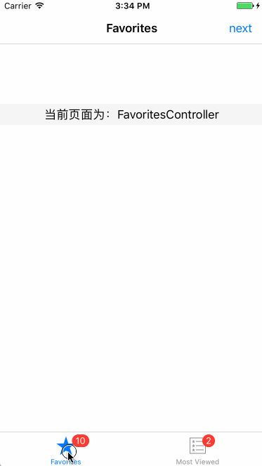

# 如何获取当前显示的控制器
我观察到点击mac版微信启动页面中的登录按钮时，手机端的微信会present出一个确认页面。细致研究时会发现如果手机端当前停留的页面是被present出来的话，此时是不会弹出确认页面的。

今天我们讨论一下，如何获取当前显示的控制器。

示例如下：



核心代码如下：

```objective-c
+ (UIViewController *)topController {
    UIViewController *topC = [self topViewController:[[UIApplication sharedApplication].keyWindow rootViewController]];
    while (topC.presentedViewController) {
        topC = [self topViewController:topC.presentedViewController];
    }
    return topC;
}

+ (UIViewController *)topViewController:(UIViewController *)controller {
    if ([controller isKindOfClass:[UINavigationController class]]) {
        return [self topViewController:[(UINavigationController *)controller topViewController]];
    } else if ([controller isKindOfClass:[UITabBarController class]]) {
        return [self topViewController:[(UITabBarController *)controller selectedViewController]];
    } else {
        return controller;
    }
}
```


大体思路是获取到window的rootViewController 之后开始递归调用(UIViewController *)topViewController:(UIViewController *)controller这个方法，直到传入的控制不再是容器类控制器后返回。返回之后会检查处理present 这种情况。